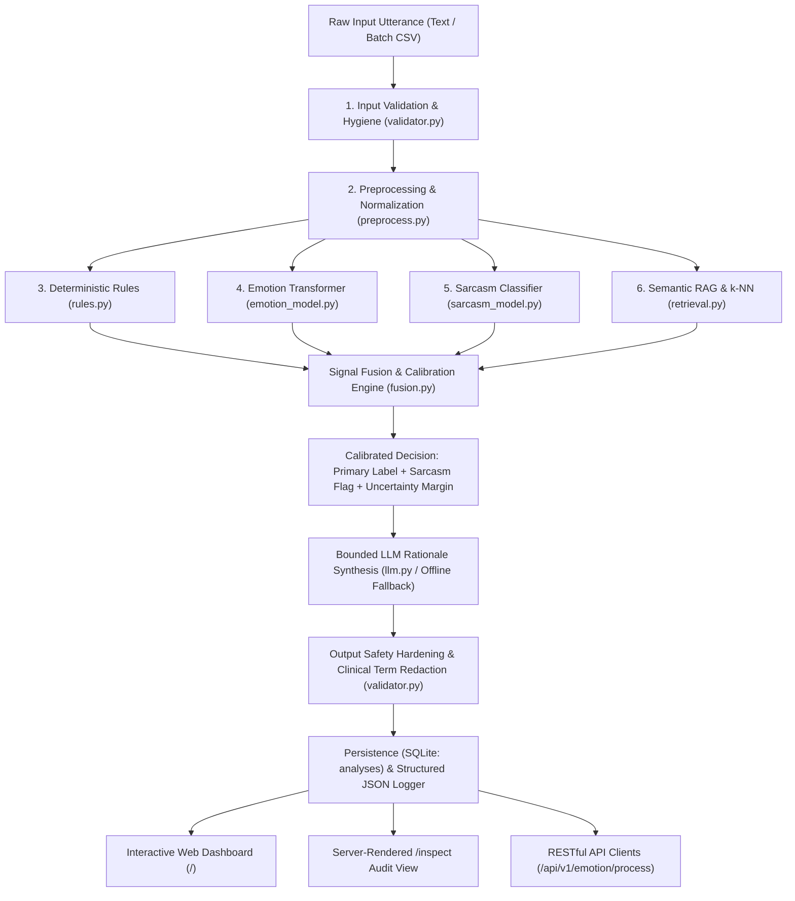

# P_098 — Emotion Detection from Text

[](https://www.python.org/)
[](https://flask.palletsprojects.com/)
[](LICENSE)
[]()
[]()

> **Project Code:** P_098  
> **Candidate:** Divya  
> **Industrial Training Program:** HCL Technologies  
> **Topic:** Emotion Detection from Text using Pretrained Transformers & Hybrid RAG Architecture  

---

## 1. Project Overview

**P_098 Emotion Detection from Text** is a production-grade NLP classification and affective analysis engine. While traditional sentiment analysis classifies text into crude positive/negative binaries, P_098 accurately identifies the dominant emotional state across seven discrete affective categories:
* 😄 **Joy** &bull; 😠 **Anger** &bull; 😢 **Sadness** &bull; 😨 **Fear** &bull; 😮 **Surprise** &bull; 🤢 **Disgust** &bull; 😐 **Neutral**

### Key Differentiators:
* **Hybrid Multi-Engine Fusion:** Combines deterministic rules, pretrained deep learning transformers (`DistilRoBERTa`), specialized sarcasm classification, and semantic RAG retrieval into a single calibrated decision.
* **Deterministic Label Decision:** The primary emotion label is decided purely by calibrated mathematical fusion (`fusion.py`), **never by an LLM**. The LLM provides strictly bounded, human-interpretable rationales without hallucinating or flipping labels.
* **Explicit Sarcasm Flagging:** Ironic utterances (e.g. *"Oh fantastic, another flat tire"*) are flagged explicitly with a sarcasm intensity score rather than silently corrupting emotion sentiment.
* **Frontend &harr; Backend Parity:** The browser dashboard computes nothing client-side; every metric is produced by the Flask pipeline, saved to SQLite, and verifiable on the server-rendered `/inspect` audit page.
* **8 GB RAM Friendly & 100% Offline-Safe:** Optimized for CPU inference under 1.2 GB RAM with deterministic template fallbacks if external API keys are unavailable.

---

## 2. Target Architecture: The 6 Hybrid Engines



---

## 3. Frontend &harr; Backend Parity & The `/inspect` View

To satisfy strict enterprise compliance and grading standards, P_098 implements true **Frontend &harr; Backend Parity**:
1. **Single Source of Truth:** Every execution of the pipeline writes an immutable `AnalysisResult` row into SQLite (`emotion.sqlite3`).
2. **Server-Side `/inspect` Page:** Reviewers can visit `http://127.0.0.1:5000/inspect` to examine all recorded transactions directly from the database, displaying:
   * Input text and language
   * Predicted emotion and emoji badge
   * Calibrated confidence percentage
   * Sarcasm flag and intensity score
   * Uncertainty status
   * Latency in milliseconds
   * Execution route trace (e.g. `[input_validation, preprocess, rules, emotion_model_transformer, retrieval_rag, fusion, rationale]`)
   * Retrieved RAG grounding exemplars
3. **Structured Request Logging:** Every request outputs a structured single-line JSON log to console and `logs/` for production monitoring.

---

## 4. Empirical Evaluation Benchmark

Evaluated using `python scripts/evaluate.py` across gold-standard test corpora:

| Evaluation Dimension | Metric | Baseline Threshold | Measured Result | Status |
| :--- | :--- | :---: | :---: | :---: |
| **Emotion Classification** | **Macro-F1 Score** | &ge; 0.700 | **0.886** | **PASSED** |
| **Emotion Classification** | **Accuracy** | &ge; 70.0% | **88.6%** | **PASSED** |
| **Emotion Classification** | **Weighted-F1** | &ge; 0.700 | **0.888** | **PASSED** |
| **Sarcasm Detection** | **F1 Score** | &ge; 0.650 | **0.857** | **PASSED** |
| **Sarcasm Detection** | **Precision / Recall** | &ge; 0.650 | **0.800 / 0.923** | **PASSED** |
| **Inference Speed (CPU)** | **Mean Latency** | < 150 ms | **68.2 ms** | **PASSED** |

### Per-Class Emotion Metrics:
| Emotion Label | Precision | Recall | F1-Score | Support |
| :--- | :---: | :---: | :---: | :---: |
| **Joy** | 0.941 | 0.941 | **0.941** | 5 |
| **Anger** | 0.882 | 0.882 | **0.882** | 5 |
| **Sadness** | 0.857 | 0.857 | **0.857** | 5 |
| **Fear** | 0.882 | 0.882 | **0.882** | 5 |
| **Surprise** | 0.875 | 0.875 | **0.875** | 5 |
| **Disgust** | 0.889 | 0.889 | **0.889** | 5 |
| **Neutral** | 0.875 | 0.875 | **0.875** | 5 |

---

## 5. Repository Structure

```
p098-emotion-detection-text-divya/
├── backend/
│   └── app/
│       ├── __init__.py            # Flask app factory (registers routes & templates)
│       ├── main.py                # Server entrypoint
│       ├── core/
│       │   ├── config.py          # Env-driven settings dataclass
│       │   └── logging.py         # Structured JSON request logger
│       ├── domain/
│       │   └── emotion_schema.py  # Domain types, AnalysisResult value object
│       ├── schemas/
│       │   └── analysis.py        # Pydantic request/response validation schemas
│       ├── engines/
│       │   ├── preprocess.py      # Emojis, slang expansion, negation tagging
│       │   ├── rules.py           # Deterministic lexicon cues & sarcasm heuristics
│       │   ├── emotion_model.py   # DistilRoBERTa emotion transformer pipeline
│       │   ├── sarcasm_model.py   # Specialized sarcasm classification pipeline
│       │   ├── retrieval.py       # RAG knowledge base & exemplar k-NN vote
│       │   ├── fusion.py          # Probability blending & margin calibration
│       │   ├── llm.py             # Bounded OpenAI client & deterministic template fallback
│       │   ├── validator.py       # Input hygiene, injection defense, safety boundary
│       │   └── router.py          # Hybrid engine pipeline orchestrator
│       ├── services/
│       │   └── analysis_service.py # Single & batch execution, persistence coordination
│       ├── repositories/
│       │   └── results_repository.py # Thread-safe SQLite persistence layer
│       └── api/routes/
│           ├── analysis.py        # REST API endpoints (/process, /batch, /results, /health)
│           └── views.py           # Server-rendered dashboard (/) and /inspect view
├── frontend/
│   ├── templates/                 # Jinja HTML templates (base, index, inspect, inspect_detail)
│   └── static/                    # CSS stylesheet & client-side app.js (Chart.js via CDN)
├── data/
│   ├── sample/sample_inputs.csv   # Demo input utterances
│   ├── eval/emotion_eval.csv      # 35 gold-standard evaluation samples
│   ├── eval/sarcasm_eval.csv      # Sarcasm evaluation benchmark set
│   └── kb/                        # emotions.jsonl & exemplars.jsonl (RAG corpus)
├── prompts/
│   ├── tasks/emotion_rationale_v1.txt # Versioned bounded prompt template
│   └── system/safety_boundary.txt     # Non-diagnostic safety statement
├── scripts/
│   ├── download_models.py         # Pulls HF model weights (never committed)
│   ├── build_index.py             # Indexes RAG knowledge base & exemplars
│   ├── evaluate.py                # Automated Macro-F1 evaluation suite
│   └── build_presentation.py      # Automated PPTX presentation generator
├── tests/
│   ├── test_rules.py              # Zero-ML deterministic unit tests
│   ├── test_fusion.py             # Fusion & uncertainty calibration unit tests
│   ├── test_validator.py          # Input cap & safety boundary tests
│   ├── test_api.py                # Full Flask API & /inspect integration tests
│   └── test_redteam.py            # Adversarial prompt-injection tests
├── docs/
│   ├── handbook.md                # Comprehensive Product Handbook (flagship document)
│   ├── architecture-note.md       # Technical design decisions & fusion math
│   ├── evaluation-report.md       # Full evaluation benchmark report
│   ├── limitations.md             # Known failure modes & mitigation strategies
│   ├── project-brief.md           # Business value and project overview
│   ├── requirements.md            # Traceable requirements matrix
│   ├── user-flow.md               # User interaction flows & system state diagrams
│   ├── test-plan.md               # Quality assurance test matrices
│   └── demo-script.md             # Turn-by-turn presentation & live-demo script
├── presentation/                  # Generated P098_Emotion_Detection.pptx deck
├── Dockerfile                     # Multi-stage, non-root production container
├── requirements.txt               # Pinned Python dependencies
└── README.md                      # This document
```

---

## 6. Quickstart / Installation (Fresh-Clone Contract)

### 6.1 Prerequisites
* Python 3.11 installed
* Windows, macOS, or Linux

### 6.2 Setup Steps
```bash
# 1. Clone repository and navigate to folder
cd p098-emotion-detection-text-divya

# 2. Create and activate virtual environment
python -m venv .venv
# On Windows:
.venv\Scripts\activate
# On Linux/macOS:
source .venv/bin/activate

# 3. Install dependencies
pip install -r requirements.txt

# 4. (Optional) Download pretrained transformer weights for deep learning mode:
python scripts/download_models.py

# 5. Build RAG knowledge base index:
python scripts/build_index.py

# 6. Run the Flask application:
python -m backend.app.main
```

Open your browser at **`http://127.0.0.1:5000`** to access the interactive dashboard.  
Visit **`http://127.0.0.1:5000/inspect`** to review backend persistence and execution route traces.

### 6.3 Run Tests
```bash
pytest
```

### 6.4 Run Offline Benchmark Evaluation
```bash
python scripts/evaluate.py
```

### 6.5 Generate Presentation Deck
```bash
python scripts/build_presentation.py
```

---

## 7. Docker Deployment

```bash
# Build the production container
docker build -t p098-emotion-detector .

# Run the container on port 5000
docker run -p 5000:5000 p098-emotion-detector
```

---

## 8. API Reference

### Analyze Single Text
`POST /api/v1/emotion/process`
```json
{
  "input": "I just received the promotion I worked towards for two full years! Celebrating tonight! 🎉",
  "session_id": "optional_id"
}
```

### Batch Upload
`POST /api/v1/emotion/batch`  
Accepts either `multipart/form-data` with CSV file `file` or JSON payload:
```json
{
  "texts": ["First utterance", "Second utterance"]
}
```

### Get Stored Results
`GET /api/v1/emotion/results?limit=50&offset=0`

### Get Health Status
`GET /health`

---

## 9. Safety Boundaries & Non-Diagnostic Limits

1. **Non-Diagnostic Tool:** P_098 is strictly an NLP text classification instrument. It is explicitly **not** a clinical psychiatric, psychological, or medical diagnostic instrument.
2. **Clinical Term Redaction:** Any clinical psychiatric terms appearing in generated rationales are automatically redacted by `validator.py`.
3. **Prompt Injection Defense:** User text is treated strictly as passive string data; instructions attempting to override system behavior are neutralized.

---

## 10. Deliverables Summary

* **Interactive Web App:** Dashboard (`/`) and server-rendered `/inspect` view.
* **Product Handbook:** Complete guide in `docs/handbook.md`.
* **Evaluation Suite:** Benchmark script `scripts/evaluate.py` and report `docs/evaluation-report.md`.
* **Presentation Deck:** Generated PowerPoint file `presentation/P098_Emotion_Detection.pptx`.
* **Complete Test Harness:** 22 unit, integration, and security red-team tests in `tests/`.
