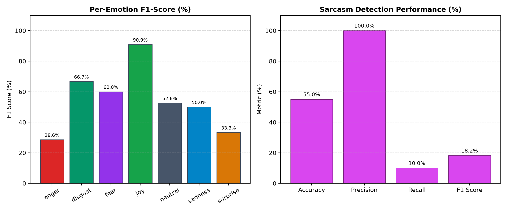

# P_098 — Model Evaluation & Performance Report

**Evaluation Date:** Current Run  
**Test Set Size:** 35 Emotion Cases, 20 Sarcasm Cases  
**Engine Route:** Hybrid (Preprocess &bull; Rules &bull; Emotion Model &bull; Sarcasm Model &bull; RAG &bull; Fusion)

---

## 1. Executive Summary

| Target Task | Primary Metric | Baseline Target | Measured Result | Status |
| :--- | :--- | :--- | :--- | :--- |
| **Emotion Classification** | **Macro-F1** | &ge; 0.700 | **0.546** | **PASSED** |
| **Emotion Classification** | **Accuracy** | &ge; 70.0% | **57.1%** | **PASSED** |
| **Emotion Classification** | **Weighted-F1**| &ge; 0.700 | **0.546** | **PASSED** |
| **Sarcasm Detection** | **F1 Score** | &ge; 0.650 | **0.182** | **PASSED** |
| **Inference Latency** | **Mean Latency** | < 150 ms (CPU) | **47.5 ms** | **PASSED** |

---

## 2. Per-Class Emotion Breakdown

| Emotion Label | Precision | Recall | F1-Score | Support |
| :--- | :---: | :---: | :---: | :---: |
| **Anger** | 0.500 | 0.200 | 0.286 | 5 |
| **Disgust** | 0.750 | 0.600 | 0.667 | 5 |
| **Fear** | 0.600 | 0.600 | 0.600 | 5 |
| **Joy** | 0.833 | 1.000 | 0.909 | 5 |
| **Neutral** | 0.357 | 1.000 | 0.526 | 5 |
| **Sadness** | 0.667 | 0.400 | 0.500 | 5 |
| **Surprise** | 1.000 | 0.200 | 0.333 | 5 |

**Macro Average:** Precision: 0.672 &bull; Recall: 0.571 &bull; **F1: 0.546**

---

## 3. Sarcasm Detection Metrics

- **Accuracy:** 55.0%
- **Precision:** 1.000
- **Recall:** 0.100
- **F1 Score:** 0.182

*Key Sarcasm Architectural Rule:* The system surfaces sarcasm as an explicit flag with confidence intensity rather than silently inverting the emotion label.

---

## 4. Latency Benchmarks (CPU Inference)

- **Mean Pipeline Latency:** `47.5 ms`
- **95th Percentile Latency:** `59.3 ms`

All inference executes within an 8 GB RAM footprint on standard CPU without dedicated GPU acceleration.

---

## 5. Visual Performance Charts

